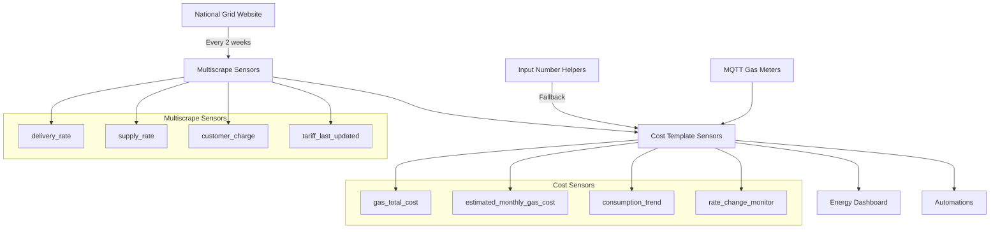

# Gas Rate Tracking Integrations

## Sensors Created

### From `multiscrape.yaml` (National Grid Website)
| Sensor | Source | Update Frequency |
|--------|--------|------------------|
| `sensor.national_grid_gas_delivery_rate` | National Grid website scraping | Every 2 weeks |
| `sensor.national_grid_gas_supply_rate` | National Grid website scraping | Every 2 weeks |
| `sensor.national_grid_gas_customer_charge` | National Grid website scraping | Every 2 weeks |
| `sensor.national_grid_gas_tariff_last_updated` | National Grid website monitoring | Every 2 weeks |

### From `gas-cost-templates.yaml` (Calculated)
| Sensor | Primary Source | Fallback Source |
|--------|----------------|-----------------|
| `sensor.gas_total_cost` | Multiscrape sensors | Input number helpers |
| `sensor.estimated_monthly_gas_cost` | Multiscrape sensors | Input number helpers |
| `sensor.current_month_gas_consumption_trend` | MQTT gas sensors | - |
| `sensor.gas_rate_change_monitor` | Multiscrape sensors | - |

### From `gas-input-helpers.yaml` (Manual Input)
| Input Number | Purpose | Default Value |
|--------------|---------|---------------|
| `input_number.gas_delivery_rate` | Fallback delivery rate | 0.6234 USD/CCF |
| `input_number.gas_supply_rate` | Fallback supply rate | 0.7892 USD/CCF |
| `input_number.gas_customer_charge` | Fallback customer charge | 14.95 USD |
| `input_number.gas_usage_alert_threshold` | Usage alert threshold | - |

## Data Flow

