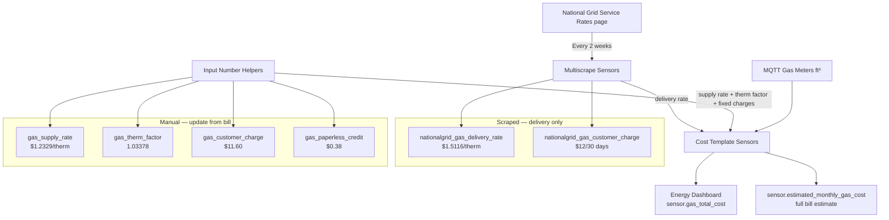

# Gas Rate Tracking Integrations

## Overview

Gas costs are calculated to match a real [National Grid](https://www.nationalgridus.com/MA-Gas-Home/) bill for Massachusetts residential heating customers.

**Utility:** National Grid — Massachusetts Gas  
**Rate schedule:** R-3B (Residential Heating — Boston territory)  
**Meter unit:** ft³ (cubic feet, via metermon over MQTT)

### Bill Calculation

National Grid bills in **therms**, not cubic feet. The meter reads ft³, which must be converted using a therm factor printed on each bill (typically ~1.034):

```
therms = (ft³ ÷ 100) × therm_factor
```

The total variable cost combines the **delivery** and **supply** components, both billed per therm:

| Line item | Rate (current) | Source |
|---|---|---|
| Gas Delivery Charge | $0.9544/therm | Scraped from National Grid website |
| Distribution Adjustment (R-3B) | $0.5572/therm | Scraped from National Grid website |
| **Total delivery rate** | **$1.5116/therm** | `sensor.nationalgrid_gas_delivery_rate` |
| Gas Supply Peak (Default Service) | $1.2329/therm | Manual — `input_number.gas_supply_rate` |

The delivery rate is the sum of the Gas Delivery Charge and the Distribution Adjustment for the R-3B (Boston) territory and is scraped automatically every 2 weeks from the [National Grid Service Rates page](https://www.nationalgridus.com/MA-Gas-Home/Service-Rates/). The supply rate changes monthly and is not published in a machine-readable format, so it must be updated manually from the bill.

Fixed and conditional charges applied in `sensor.estimated_monthly_gas_cost`:

| Charge | Amount | Notes |
|---|---|---|
| Minimum charge | $12.00/30 days (prorated) | e.g. $11.60 for a 29-day billing period |
| MA Winter Bill Relief | −10% of total | Automatically applied in Feb & Mar |
| Paperless billing credit | −$0.38 | `input_number.gas_paperless_credit` |

> **Note:** `sensor.gas_total_cost` (used by the Energy Dashboard) tracks cumulative variable usage cost only — it does not include the minimum charge, winter relief, or paperless credit. `sensor.estimated_monthly_gas_cost` applies all charges for a full bill estimate.

---

## Sensors Created

### From `multiscrape.yaml` (National Grid Website)
| Sensor | Source | Update Frequency |
|--------|--------|------------------|
| `sensor.nationalgrid_gas_delivery_rate` | Service Rates page (R-3B: delivery + dist. adj.) | Every 2 weeks |
| `sensor.nationalgrid_gas_customer_charge` | Service Rates page (R-3B: $12/30 days) | Every 2 weeks |
| `sensor.nationalgrid_gas_tariff_updated` | Tariff Provisions page | Every 2 weeks |

> **Note:** The gas supply rate is not published by National Grid in a machine-readable format and is therefore not scraped. Use `input_number.gas_supply_rate` and update it manually from each bill.

### From `gas-cost-templates.yaml` (Calculated)
| Sensor | Primary Source | Fallback Source |
|--------|----------------|-----------------|
| `sensor.gas_total_cost` | Multiscrape delivery + `input_number` supply | Input number helpers |
| `sensor.estimated_monthly_gas_cost` | All rates + fixed charges + seasonal adjustments | Input number helpers |
| `sensor.current_month_gas_consumption_trend` | MQTT gas sensors | — |
| `sensor.gas_rate_change_monitor` | Multiscrape + input_number sensors | — |

### From `gas-input-helpers.yaml` (Manual Input)
| Input Number | Purpose | Current Value |
|--------------|---------|---------------|
| `input_number.gas_delivery_rate` | Fallback delivery rate if scrape fails | 1.5118 USD/therm |
| `input_number.gas_supply_rate` | Supply rate (update monthly from bill) | 1.2329 USD/therm |
| `input_number.gas_therm_factor` | CCF → therm conversion (from bill) | 1.03378 |
| `input_number.gas_customer_charge` | Minimum charge per billing period | 11.60 USD |
| `input_number.gas_paperless_credit` | Paperless billing credit | 0.38 USD |
| `input_number.gas_usage_alert_threshold` | Usage alert threshold | — |

## Data Flow


```mermaid
graph TD
    A[National Grid Service Rates page] -->|Every 2 weeks| B[Multiscrape Sensors]
    B -->|delivery rate| C[Cost Template Sensors]
    D[Input Number Helpers] -->|supply rate + therm factor + fixed charges| C
    E[MQTT Gas Meters ft³] --> C
    C --> F[Energy Dashboard\nsensor.gas_total_cost]
    C --> G[sensor.estimated_monthly_gas_cost\nfull bill estimate]

    subgraph "Scraped — delivery only"
        B1[nationalgrid_gas_delivery_rate\n$1.5116/therm]
        B2[nationalgrid_gas_customer_charge\n$12/30 days]
    end

    subgraph "Manual — update from bill"
        D1[gas_supply_rate\n$1.2329/therm]
        D2[gas_therm_factor\n1.03378]
        D3[gas_customer_charge\n$11.60]
        D4[gas_paperless_credit\n$0.38]
    end

    B --> B1
    B --> B2
    D --> D1
    D --> D2
    D --> D3
    D --> D4
```